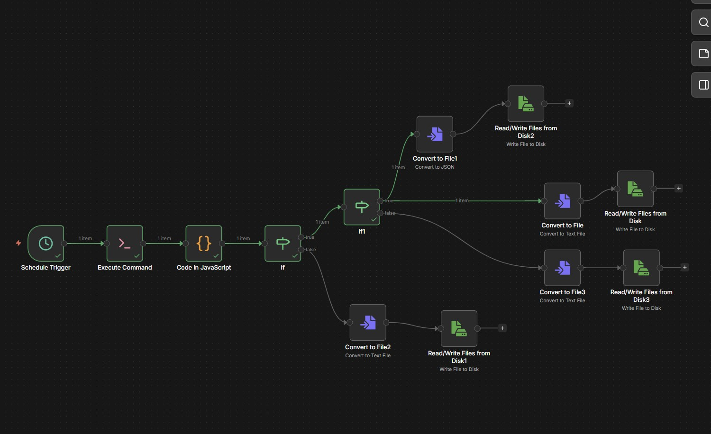

# File Integrity Check


A monitoring tool designed to detect **file deletions, rollbacks
(version reverts), and unexpected changes** in large directory trees.

This project was created to investigate cases where files on a shared
storage portal were:

-   reverting to older versions
-   disappearing unexpectedly
-   being modified without clear traceability

The system performs scheduled scans of a directory tree and records file
metadata and content fingerprints. Results are stored and compared
against previous runs to detect anomalies.

The system is designed to handle **very large multi‑terabyte directory
structures efficiently**.

------------------------------------------------------------------------

# Architecture

The system consists of three main components:

1.  **Python Scanner**
2.  **n8n Workflow**
3.  **SQLite State Database**



### Execution Flow

    n8n Schedule Trigger
            ↓
    Execute Command Node
            ↓
    Python Scanner (watch_s_drive.py)
            ↓
    JSON result printed to stdout
            ↓
    JavaScript Code Node parses output
            ↓
    Report files written to disk
            ↓
    Optional alerts for high severity events

------------------------------------------------------------------------

# What the Program Detects

The scanner detects the following events:

  -----------------------------------------------------------------------
  Event Type                          Description
  ----------------------------------- -----------------------------------
  **missing**                         A file previously present no longer
                                      exists

  **changed**                         File contents changed to a new
                                      version

  **reverted**                        File contents match an **older
                                      previously recorded version**

  **mtime_went_back**                 File modification timestamp moved
                                      backwards
                                      
  -----------------------------------------------------------------------

High severity alerts typically include:

-   deleted files
-   reverted file versions

------------------------------------------------------------------------

# Performance Design

This tool is designed for **very large directory trees**.

### Metadata-first scanning

The scanner first collects only:

-   file path
-   file size
-   modification time

Hashing only occurs when metadata changes.

### Partial hashing

Large files use:

    first N bytes + last N bytes + file size

instead of hashing the entire file.

### Parallel hashing

Parallel hashing is controlled by:

    --max-workers 6

This dramatically speeds up scanning without overwhelming disk IO.

### Directory pruning

Directories can be excluded early in traversal to avoid scanning large
archive areas.

Examples:

-   directories starting with numbers
-   archive folders
-   system folders

------------------------------------------------------------------------

# Repository Structure

    project/
    │
    ├── watch_s_drive.py
    ├── workflows/
    │     file_integrity_workflow.json
    │
    ├── reports/
    │
    ├── n8n.png
    └── README.md

------------------------------------------------------------------------

# Installation

## Install Node.js

https://nodejs.org/

## Install n8n

    npm install n8n -g

------------------------------------------------------------------------

# Running n8n

PowerShell:

    $env:NODES_EXCLUDE='[]'
    $env:N8N_RESTRICT_FILE_ACCESS_TO="C:\...\project\file_check;C:\...\reports"

    n8n start

Open:

    http://localhost:5678

------------------------------------------------------------------------

# Python Scanner Execution

Example command used in the **Execute Command node**:

    cmd /c python "C:\...\file_check\watch_s_drive.py" ^
        --root "C:\\" ^
        --max-workers 6 ^
        --no-hash-new-files ^
        --latest-json "C:\...\file_check\reports\latest.json"

### Arguments

  Argument              Description
  --------------------- -----------------------------
  --root                Root directory to scan
  --max-workers         Number of hashing threads
  --no-hash-new-files   Skip hashing for new files
  --latest-json         Path for latest run summary

------------------------------------------------------------------------

# n8n Workflow

The repository contains an exported workflow:

    workflows/file_integrity_workflow.json

To import into n8n:

1.  Open the n8n editor UI
2.  Click **Import Workflow**
3.  Select the JSON file
4.  Adjust file paths for your environment

------------------------------------------------------------------------

# Configuration

Several configuration options control how scanning behaves.

### Directory Exclusions

Directories can be excluded using rules such as:

-   folder names starting with numbers
-   archive folders
-   system folders

Example configuration inside the script:

    EXCLUDED_DIR_NAMES = {
        "System Volume Information",
        "$RECYCLE.BIN",
        "Archive",
        "Backups"
    }

Entire path prefixes may also be excluded:

    EXCLUDED_PATH_PREFIXES = [
        r"S:\Archive",
        r"S:\Backups"
    ]

### Performance Settings

  Setting             Purpose
  ------------------- ------------------------------
  max-workers         Parallel hashing threads
  sample-bytes        Size of file sections hashed
  no-hash-new-files   Skip hashing new files

These settings allow the scanner to scale to **multi-terabyte storage
systems**.

------------------------------------------------------------------------

# Output Files

### JSON summary

    reports/latest.json

Example:

    {
      "run_id": "2026-03-06T01-00",
      "stats": {
        "scanned_files": 145233,
        "hashed_files": 431,
        "events": 2,
        "high": 1
      }
    }

### CSV report

    events_<runid>.csv

------------------------------------------------------------------------

# Quick Start (5 Minute Setup)

1.  Install Node.js
2.  Install n8n

```{=html}
<!-- -->
```
    npm install n8n -g

3.  Clone repository

```{=html}
<!-- -->
```
    git clone https://github.com/<your-user>/file_integrity_check.git

4.  Start n8n

```{=html}
<!-- -->
```
    n8n start

5.  Open

```{=html}
<!-- -->
```
    http://localhost:5678

6.  Import workflow from:

```{=html}
<!-- -->
```
    workflows/file_integrity_workflow.json

7.  Update file paths in the Execute Command node.

8.  Run workflow once to verify output.

------------------------------------------------------------------------

# Troubleshooting

## S: Drive Not Found

Mapped drives may not exist for background services.

Use a UNC path instead:

    \\server\share

Example:

    --root "\\server\share"

------------------------------------------------------------------------

## n8n Cannot Access Files

Check environment variable:

    N8N_RESTRICT_FILE_ACCESS_TO

Example:

    $env:N8N_RESTRICT_FILE_ACCESS_TO="C:\project\file_check;C:\reports"

------------------------------------------------------------------------

## Python Script Produces No Output

If n8n reports:

    ERROR: No stdout from Python run

Check:

-   Python path
-   script permissions
-   JSON printed to stdout

Manual test:

    python watch_s_drive.py --root "S:\"

------------------------------------------------------------------------

## Slow Scans

Large directory trees may require tuning.

Try:

    --no-hash-new-files
    --max-workers 4

and exclude archive directories.

------------------------------------------------------------------------

# Use Cases

This system is useful for:

-   detecting silent data corruption
-   identifying unintended file rollbacks
-   auditing large shared storage
-   monitoring research data environments

------------------------------------------------------------------------

# License

MIT License
