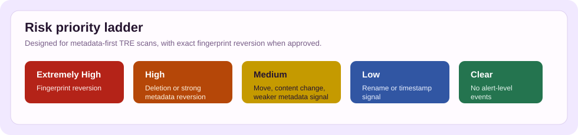
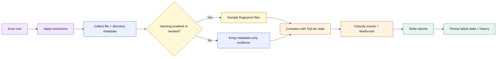
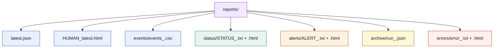

# File Integrity Monitor

A Python-only file and directory integrity monitor for secure research
environments, large Windows shares, and offline portals. It replaces the n8n
workflow exported at `reports/workflow/FileIntegrityCheckWorkflow.json` while
keeping the same operational intent: scan, compare with previous state,
classify risk, and write clear operator reports.

The runtime uses only the Python standard library. There are no runtime package
dependencies, no internet calls, and no external assets in the generated HTML
reports.



## At A Glance

| Area | What It Does |
| --- | --- |
| State | Stores file, directory, fingerprint, and metadata history in SQLite |
| Scale | Supports metadata-first scanning for millions of very large files |
| TRE mode | `--no-hash-new-files` avoids opening new or fingerprint-missing files |
| Reversion | Exact fingerprint reversion is critical; metadata-only approximation is also available |
| Reports | Writes offline HTML, text summaries, CSV event exports, and compact JSON |
| Scheduling | Can run once, repeat on a Python loop, or be scheduled weekly by the platform |
| Exclusions | Skips numbered folders by default and supports a non-coder editable exclusions file |

> [!NOTE]
> For large TRE shares, the recommended default is metadata-first scanning with
> `--no-hash-new-files`. Exact reversion detection becomes available for paths
> once fingerprinting has been approved and captured.

---

## Workflow


```mermaid
flowchart LR
    A["Scan root"] --> B["Apply exclusions"]
    B --> C["Collect file + directory metadata"]
    C --> D{"Hashing enabled or needed?"}
    D -->|Yes| E["Sample fingerprint files"]
    D -->|No| F["Keep metadata-only evidence"]
    E --> G["Compare with SQLite state"]
    F --> G
    G --> H["Classify events + likelihoods"]
    H --> I["Write reports"]
    I --> J["Persist latest state + history"]

    classDef scan fill:#f1e9ff,stroke:#8b3a9c,color:#25142f;
    classDef metadata fill:#e9f0ff,stroke:#3156a3,color:#25142f;
    classDef hash fill:#fff8d6,stroke:#8a6a00,color:#25142f;
    classDef report fill:#e6f5ee,stroke:#24744f,color:#25142f;
    classDef risk fill:#fff3e0,stroke:#b54708,color:#25142f;
    class A,B scan;
    class C,F metadata;
    class D,E hash;
    class G,H risk;
    class I,J report;
```

The scan records both files and directories. Directory deletion can therefore be
reported even when a folder was empty.

---

## Risk Model

The human report uses a color-coded ladder. Exact intent is never presented as
proof; these labels are review priorities based on filesystem evidence.

| Alert | Typical Meaning | Examples |
| --- | --- | --- |
| Extremely High | Fingerprint-proven version reversion | Current fingerprint matches an older historical fingerprint for the same path |
| High | Likely deletion/unavailability or stronger metadata reversion signal | File disappeared, directory disappeared, file returned to previous size+mtime, directory returned to previous mtime+child-count state |
| Medium | Review item with material operational impact | Content changed, metadata changed without fingerprint evidence, moved file, moved and renamed file, directory move/rename, size-only metadata reversion pattern |
| Low | Lower priority integrity signal | Same-folder file rename, modified time moved backwards |
| Clear | No alert-level integrity events detected | No events |

### Move And Rename Definitions

| Classification | Definition | Risk |
| --- | --- | --- |
| Likely renamed | Same folder, different file name | Low |
| Likely moved | Same file name, different folder/location | Medium |
| Likely moved and renamed | Different folder/location and different file name | Medium |

Moves are ranked above same-folder renames because a location change has more
operational impact. Same-folder cleanup such as `draft 2.md` to `draft2.md` is
treated as a likely rename.

## Detection Coverage

| Signal | Requires Fingerprint? | Notes |
| --- | --- | --- |
| File deletion or unavailability | No | Path missing from latest scan |
| Directory deletion or unavailability | No | Directory paths are baselined directly, including empty directories |
| Same-folder file rename | No | Uses filename-equivalent signatures, size, and folder evidence |
| File move or moved-and-renamed | Better with fingerprint, possible without | Fingerprints give high confidence; metadata gives lower confidence |
| Directory move or rename | No | Uses directory path/name/location evidence |
| Content changed | Yes | Compares current fingerprint with previous fingerprint |
| Exact version reversion | Yes | Current fingerprint matches an older historical fingerprint |
| Possible file metadata reversion | No | Uses compact size/mtime history when fingerprint coverage is absent |
| Possible directory metadata reversion | No | Uses compact directory mtime and immediate child-count history |
| Modified time moved backwards | No | Low-risk timestamp signal |

The report shows `Reversion unprotected` for current files that do not yet have
fingerprint coverage. Those files can still produce metadata-based warnings, but
exact content reversion detection requires fingerprints.

> [!IMPORTANT]
> Fingerprint-proven `reverted` events are the highest priority because they
> show that content has returned to a previously observed fingerprint. Metadata
> reversion events are useful approximations, not proof.

## Event Name Reference

The CSV and JSON outputs use stable event names:

| Event Type | Typical Alert | Meaning |
| --- | --- | --- |
| `missing` | High, Medium, or Low | A known file path disappeared; may be deletion, unavailability, rename, move, or moved-and-renamed |
| `directory_missing` | High or Medium | A known directory path disappeared; may be deletion, unavailability, rename, or move |
| `changed` | Medium | Fingerprint changed from the previous known fingerprint |
| `metadata_changed` | Medium | Size or modified time changed but the file lacks prior fingerprint evidence |
| `reverted` | Extremely High | Current fingerprint matches a previous historical fingerprint |
| `possible_metadata_reverted` | High or Medium | File metadata returned to a previous size/mtime or size-only pattern |
| `possible_directory_metadata_reverted` | High or Medium | Directory metadata returned to a previous mtime/child-count or child-count-only pattern |
| `mtime_went_back` | Low | Modified time is older than the previous recorded modified time |

---

## Requirements

- Python 3.10 or newer
- Windows, macOS, or Linux
- Write access to the SQLite database path and report output directory

Check Python:

```powershell
python --version
```

If Windows cannot find `python`, install Python from
[python.org](https://www.python.org/downloads/windows/) and enable
`Add python.exe to PATH`, or use the Python Launcher command `py`.

## Installation

From this folder:

```powershell
python -m venv .venv
.\.venv\Scripts\Activate.ps1
python -m pip install -e .
```

Run the complete workflow once:

```powershell
file-watch run --root "S:\" --max-workers 6 --no-hash-new-files
```

Or use the compatibility wrapper without installing the package:

```powershell
python .\file_check.py --root "S:\" --max-workers 6 --no-hash-new-files
```

Scanner-only compatibility wrapper:

```powershell
python .\watch_s_drive.py --root "S:\" --max-workers 6 --no-hash-new-files --latest-json ".\reports\latest.json"
```

## Recommended TRE Mode

For very large shares with millions of multi-GB or multi-TB files, start with a
metadata-first baseline:

```powershell
file-watch run --root "S:\" --no-hash-new-files --max-workers 6 --history-retention-per-path 5 --json-detail compact
```

This creates a path, directory, and metadata baseline without opening new or
fingerprint-missing files for hashing. Later runs still detect missing files,
missing directories, moves, renames, metadata changes, and possible metadata
reversion patterns.

> [!CAUTION]
> `--no-hash-new-files` protects storage performance, but exact content
> reversion detection needs historical fingerprints. Use targeted maintenance
> fingerprinting for the folders where exact reversion detection matters most.

For folders where exact version reversion detection is required immediately, run
an approved maintenance pass:

```powershell
file-watch run --root "S:\" --hash-new-files --max-workers 6
```

That pass fingerprints brand-new files and backfills missing fingerprints. It is
more expensive and should be scheduled only when the TRE has approved the I/O
cost.

## Exclusions

By default, the scanner skips:

- folders whose name starts with a number, such as `2023` or `1_old`
- common system/build folders such as `$RECYCLE.BIN`, `.git`, `node_modules`, `Archive`, and `Backups`
- the default full path prefixes `S:\Archive`, `S:\Backups`, and `S:\OldProjects`

Use `--include-numbered-dirs` if numbered folders should be scanned.

For non-coders, maintain a plain text file such as `config\exclude_dirs.txt`:

```text
# One directory name per line
Drafts
TempUploads
DoNotScan
```

Then run:

```powershell
file-watch run --root "S:\" --exclude-file ".\config\exclude_dirs.txt" --max-workers 6 --no-hash-new-files
```

Advanced entries are also supported:

```text
dir: ExactFolderName
prefix: S:\A\Whole\Subtree\To\Skip
```

## Output Layout

`file-watch run` creates the report root and these standard subfolders if they
do not already exist:

```text
reports\
  events\
  human\
  status\
  alerts\
  archive\
  errors\
```

`file-watch scan` creates the output directory and `events` folder as needed for
CSV output.


```mermaid
flowchart TD
    R["reports/"]
    R --> L["latest.json"]
    R --> H["HUMAN_latest.html"]
    R --> E["events/events_<run_id>.csv"]
    R --> S["status/STATUS_<run_id>.txt + .html"]
    R --> A["alerts/ALERT_<run_id>.txt + .html"]
    R --> AR["archive/run_<run_id>.json"]
    R --> ER["errors/error_<date>.txt + .html"]

    classDef root fill:#f1e9ff,stroke:#8b3a9c,color:#25142f;
    classDef latest fill:#e9f0ff,stroke:#3156a3,color:#25142f;
    classDef clear fill:#e6f5ee,stroke:#24744f,color:#25142f;
    classDef alert fill:#fff3e0,stroke:#b54708,color:#25142f;
    classDef archive fill:#fff8d6,stroke:#8a6a00,color:#25142f;
    classDef error fill:#fff0ed,stroke:#b42318,color:#25142f;
    class R root;
    class L,H,E latest;
    class S clear;
    class A alert;
    class AR archive;
    class ER error;
```

| Path | When | Purpose |
| --- | --- | --- |
| `reports/latest.json` | every workflow run | latest machine-readable payload |
| `reports/HUMAN_latest.html` | every workflow run | convenience copy of the newest human report |
| `reports/human/run_<run_id>.html` | every workflow run | archived run-specific human report |
| `reports/events/events_<run_id>.csv` | every scan | flat event report |
| `reports/STATUS_latest.txt` | success with no critical/high events | operator status summary |
| `reports/STATUS_latest.html` | success with no critical/high events | visual status report |
| `reports/status/STATUS_<run_id>.txt` | success with no critical/high events | archived status summary |
| `reports/status/STATUS_<run_id>.html` | success with no critical/high events | archived visual status report |
| `reports/alerts/ALERT_<run_id>.txt` | success with critical/high events | archived alert report |
| `reports/alerts/ALERT_<run_id>.html` | success with critical/high events | archived visual alert report |
| `reports/ALERT_latest.txt` | success with critical/high events | latest alert shortcut |
| `reports/ALERT_latest.html` | success with critical/high events | latest visual alert shortcut |
| `reports/archive/run_<run_id>.json` | critical/high events by default | archived JSON payload |
| `reports/errors/error_<date>.txt` | operational failure | error report |
| `reports/errors/error_<date>.html` | operational failure | visual error report |

`*_latest` files are convenience shortcuts. Run-specific files containing
`<run_id>` are the durable audit records. Older top-level
`reports/events_*.csv` files are moved into `reports/events` automatically on
the next scan.

---

## CLI Reference

### Complete Workflow

```powershell
file-watch run --root "S:\" [options]
```

Useful options:

```text
--db PATH                         SQLite state database
--outdir PATH                     report directory, default reports
--latest-json PATH                latest JSON path, default reports/latest.json for run
--hash-new-files                  fingerprint brand-new files and backfill missing fingerprints
--no-hash-new-files               store new or fingerprint-missing files without hashing them
--max-workers N                   hashing workers, default 6
--sample-bytes N                  bytes sampled from each end of large files
--history-retention-per-path N    unique history states retained per path, default 5; 0 keeps all
--exclude-dir NAME                add an excluded directory name
--exclude-prefix PATH             add an excluded path subtree
--exclude-file PATH               read extra exclusions from a plain text file
--clear-default-exclusions        use only exclusions supplied on CLI
--include-numbered-dirs           do not skip directories beginning with a digit
--archive-policy high|always|never
--json-detail compact|full        compact saved JSON by default; CSV/HTML keep details
--fail-on-high                    return exit code 1 when critical/high events exist
```

### Scanner Only

```powershell
file-watch scan --root "S:\" --latest-json ".\reports\latest.json"
```

`scan` prints raw scan JSON and writes the events CSV. It does not write status,
alert, archive, or error reports.

### Repeat Without n8n

```powershell
file-watch schedule --root "S:\" --interval-seconds 3600 --max-workers 6 --no-hash-new-files
```

Use `--runs N` to stop after a fixed number of runs.

### Weekly Monday Mornings

Pure-Python weekly loop:

```powershell
file-watch weekly --root "S:\" --weekday monday --time 09:00 --max-workers 6 --no-hash-new-files
```

Dry run the next scheduled time:

```powershell
file-watch weekly --root "S:\" --weekday monday --time 09:00 --dry-run
```

For a secure portal, a platform scheduler is usually preferable.

## Windows Task Scheduler

After installing with `python -m pip install -e .`, create a task:

```text
Program/script: C:\Path\To\Project\.venv\Scripts\file-watch.exe
Arguments: run --root "S:\" --max-workers 6 --no-hash-new-files --exclude-file ".\config\exclude_dirs.txt"
Start in: C:\Alieyeh\project\file_check
```

Set the trigger to weekly, Monday, 09:00 or the portal-approved morning window.

If you do not install the package, schedule the wrapper:

```text
Program/script: C:\Path\To\Python\python.exe
Arguments: C:\Alieyeh\project\file_check\file_check.py --root "S:\" --max-workers 6 --no-hash-new-files --exclude-file ".\config\exclude_dirs.txt"
Start in: C:\Alieyeh\project\file_check
```

## Storage Model

SQLite is designed to stay compact:

| Table | Purpose |
| --- | --- |
| `latest_by_path` | one current row per tracked file path |
| `latest_directories` | one current row per tracked directory path, including empty directories |
| `history_by_path` | unique fingerprint states per path |
| `metadata_history_by_path` | unique file size/mtime states per path |
| `directory_history_by_path` | unique directory mtime and immediate child-count states per path |
| `runs` | run audit records |

Additional storage behavior:

- `latest_by_path.seen_count` records how many times each current file path has been observed.
- fingerprint history is deduplicated by path and fingerprint.
- metadata history is deduplicated by path and metadata state.
- `--history-retention-per-path 5` keeps the latest five unique states per path by default.
- `--history-retention-per-path 0` keeps all retained history.
- saved JSON uses `--json-detail compact` by default; detailed evidence remains in CSV and HTML reports.
- use `--json-detail full` only when full embedded event detail is required in JSON.

---

## Hashing Policy

With `--no-hash-new-files`:

- new files are stored without fingerprints.
- files with missing fingerprints remain metadata-only on later observations.
- missing fingerprints are not a reason to open large files for hash backfill.
- metadata-only changes generate review events when size or mtime changes.
- possible file metadata reversion uses prior size/mtime history.

With `--hash-new-files`:

- new files are fingerprinted.
- missing fingerprints are backfilled.
- future exact content-change and version-reversion checks become available for those paths.

Large-file hashing is sampled. Files up to `2 * --sample-bytes` are read fully;
larger files read the first and last sample only. The default sample size is
1 MB, so a large file reads about 2 MB when hashing is enabled.

## Trusted Research Environment Notes

The project is suitable for a secure trusted research environment with no direct
internet access:

- runtime code uses only Python standard library modules.
- installation can be performed with `pip` from an approved source folder or wheel.
- reports are offline HTML with embedded CSS and no external assets.
- generated reports and SQLite state may contain sensitive paths and filenames; store them in an approved secure location.
- export the empty `file_watch_state.sqlite3` created by this repository only after clearing local data.

> [!TIP]
> For TRE transfer, include the source code, `config`, `docs`, tests, and an
> empty `file_watch_state.sqlite3`. Do not transfer local generated reports
> unless they have been reviewed for sensitive paths.

More deployment detail is in [docs/TRE_DEPLOYMENT.md](docs/TRE_DEPLOYMENT.md).

## Tests

Run the test suite:

```powershell
python -m unittest discover -s tests
```

No external test dependencies are required.

## Migration From n8n

Old n8n scanner command:

```powershell
cmd /c python ".\watch_s_drive.py" --root "<SCAN_ROOT>" --max-workers 6 --no-hash-new-files --latest-json ".\reports\latest.json"
```

Python-only complete workflow:

```powershell
python .\file_check.py --root "<SCAN_ROOT>" --max-workers 6 --no-hash-new-files
```

Installed console script:

```powershell
file-watch run --root "<SCAN_ROOT>" --max-workers 6 --no-hash-new-files
```

See [docs/MIGRATION_FROM_N8N.md](docs/MIGRATION_FROM_N8N.md) for the node-by-node mapping.
