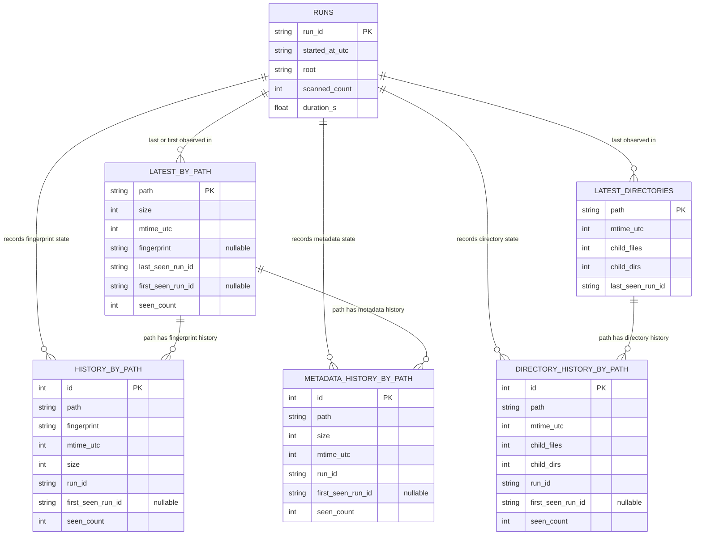

# Database Schema

The monitor stores its durable state in SQLite. Paths are normalized absolute
paths and remain whole strings so comparisons, move/rename evidence, exports,
and migration from the original workflow stay straightforward.

## Entity Relationship Diagram

> [!NOTE]
> These are logical relationships. SQLite foreign-key constraints are not
> declared because historical rows intentionally remain useful after a path
> disappears from the latest baseline.

## Tables

| Table | Cardinality | Purpose |
| --- | --- | --- |
| `runs` | one row per completed scan | Audit identity, root, count, and elapsed scan time |
| `latest_by_path` | at most one row per file path | Current file baseline |
| `history_by_path` | bounded unique fingerprints per file path | Exact content change and reversion evidence |
| `metadata_history_by_path` | bounded unique size/mtime states per file path | Metadata-only reversion approximation |
| `latest_directories` | at most one row per directory path | Current directory baseline, including empty directories |
| `directory_history_by_path` | bounded unique directory states per path | Directory metadata reversion approximation |

## Identity And Uniqueness

- `latest_by_path.path` and `latest_directories.path` are primary keys.
- fingerprint history is unique on `(path, fingerprint)`.
- file metadata history is unique on `(path, size, mtime_utc)`.
- directory history is unique on
  `(path, mtime_utc, child_files, child_dirs)`.
- repeated observations increment `seen_count` instead of creating duplicate
  history rows.
- history retention defaults to five unique states per path.

## Transaction Behavior

A completed baseline is persisted with batched SQLite upserts inside one
transaction. If scanning, hashing, comparison, or persistence fails, the new
baseline is not committed. Report-write failures are described separately
because they can occur after the database transaction has completed.

## Why Paths Are Not Split

Splitting every path into directory and filename entities could reduce repeated
text in very large databases, but it would add joins to the hottest comparison
and reporting paths and require a disruptive migration. The current model keeps
path identity explicit and predictable. A future normalized path dictionary
would be reasonable only after measuring the real database size and query cost
on representative TRE data.

